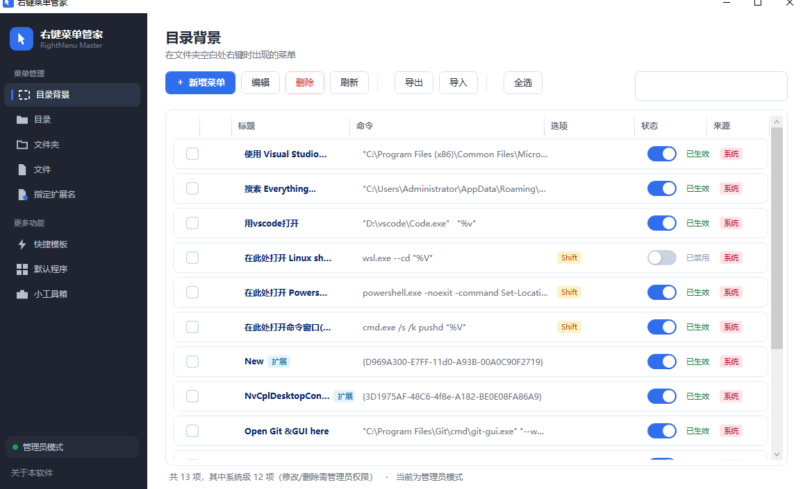
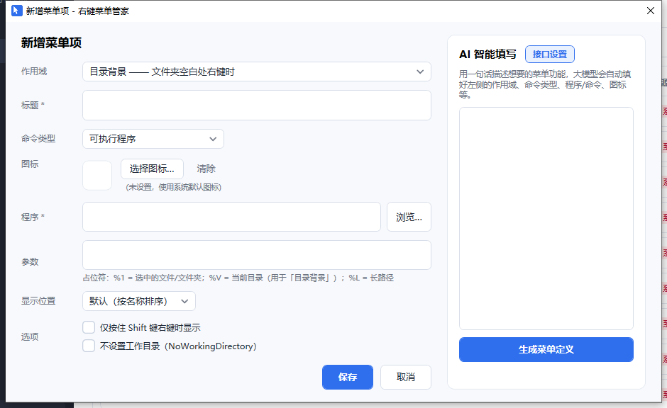
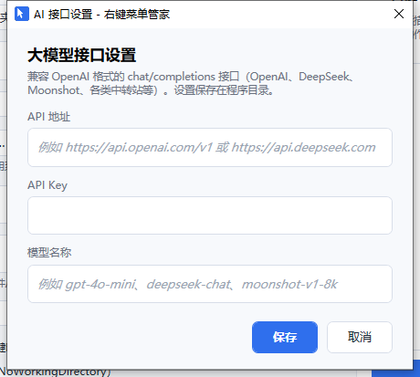
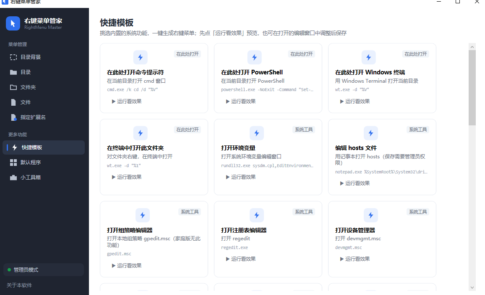
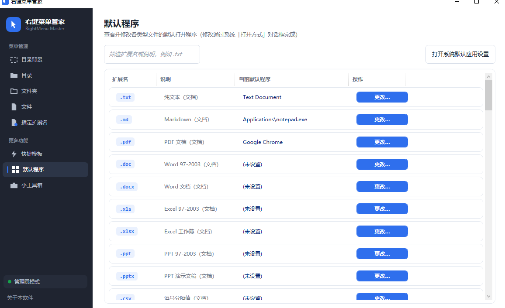
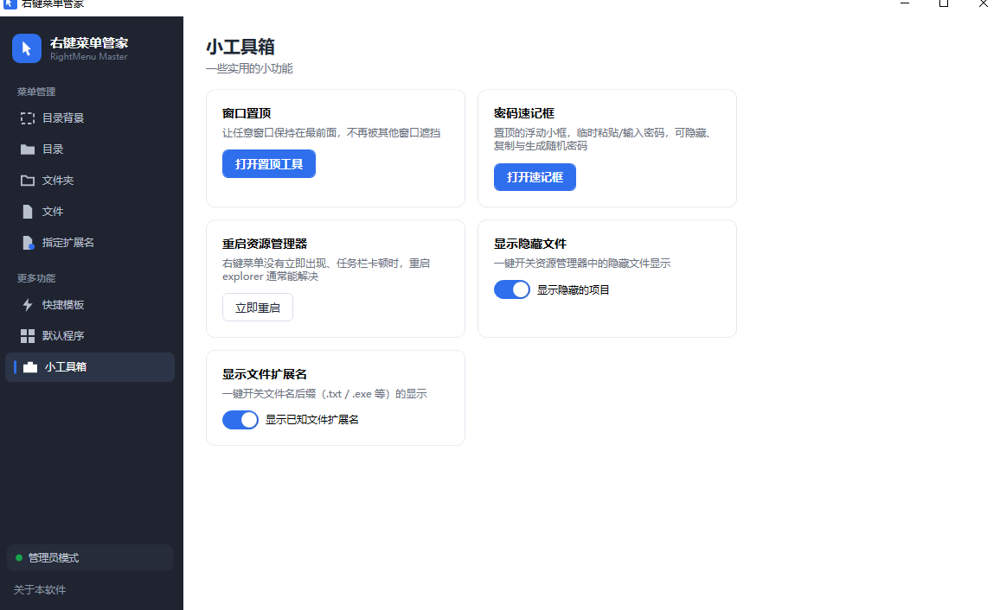
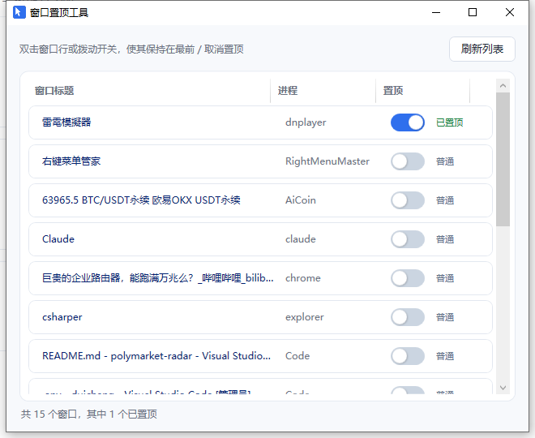
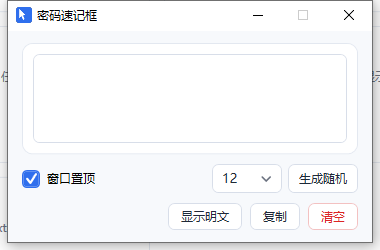

# 右键菜单管家（RightMenu Master）

一款轻量、开源的 Windows 右键上下文菜单管理工具。按作用域分类管理右键菜单，支持新增 / 编辑 / 删除、自定义图标、一键启用禁用、快捷模板、默认程序管理、AI 智能填写，还附带窗口置顶、密码速记框等实用小工具。纯注册表实现，不注入 Shell、不装驱动、无后台常驻。

## 功能特性

- **按作用域分类**：目录背景 / 目录 / 文件夹 / 文件 / 指定扩展名，五种右键场景分开管理
- **菜单项增删改**：自定义标题、命令、图标（内置 / 系统文件提取 / 图片）、显示位置、Shift 限定等
- **三种命令类型**：可执行程序、CMD 命令、PowerShell 脚本
- **启用 / 禁用开关**：列表内拨动开关即时生效，禁用不删除、随时恢复
- **系统扩展菜单（shellex）**：可枚举 Git、网盘等第三方 Shell 扩展菜单并禁用
- **快捷模板**：内置「在此处打开终端 / 环境变量 / hosts / 组策略」等常用系统功能，一键生成，可先预览运行效果再保存
- **默认程序管理**：常用后缀的当前默认程序一目了然，一键调起系统「打开方式」更改
- **AI 智能填写**：配置任意 OpenAI 兼容接口，用一句话描述需求，自动填好作用域、命令、图标等全部字段
- **导出 / 导入**：菜单配置导出为 JSON，便于备份与多机同步
- **小工具箱**：窗口置顶、密码速记框、重启资源管理器、显示隐藏文件、显示扩展名
- **批量操作**：行勾选框 + 全选按钮，批量删除 / 导出 / 启禁用
- 搜索过滤、列头点击排序、管理员权限自动提权提示

## 界面一览



## 环境要求

| 项目 | 要求 |
| --- | --- |
| 系统 | Windows 10 / 11（64 位） |
| 运行 | .NET Desktop Runtime 10（从源码编译则需要 .NET SDK 10） |
| 权限 | 普通用户即可使用；修改「系统」来源的菜单项时会自动请求管理员提权 |

## 获取与运行

从源码编译运行：

```bash
git clone https://github.com/<你的用户名>/rightmenu.git
cd rightmenu/src/RightMenuMaster
dotnet run -c Release
```

或编译为可执行文件后直接双击 `RightMenuMaster.exe`：

```bash
dotnet build -c Release
# 产物位于 bin/Release/net10.0-windows/
```

也可用 `dotnet publish -c Release -r win-x64 --self-contained true` 发布单文件免安装版。

程序为绿色软件，配置（含 AI 接口设置）保存在程序所在目录，无安装、无注册表垃圾。

## 使用指南

### 1. 主界面：按作用域管理菜单

左侧导航在五种右键场景之间切换：

| 作用域 | 对应场景 |
| --- | --- |
| 目录背景 | 文件夹空白处右键 |
| 目录 | 右键文件夹（目录对象） |
| 文件夹 | 资源管理器中的文件夹 |
| 文件 | 右键任意文件 |
| 指定扩展名 | 仅某一种后缀（如 `.txt`）的文件 |


- 工具栏：新增菜单、编辑、删除、刷新、导出、导入、全选；右侧搜索框按标题 / 命令实时过滤。
- 每行最前面的勾选框表示「选中」，配合工具栏按钮做批量操作；点击列头可排序。
- 「来源」列区分 **系统**（HKLM，所有用户，修改需管理员权限）、**用户**（HKCU）、**扩展**（第三方 shellex 扩展）。
- 「状态」列的拨动开关 = 启用 / 禁用：关掉后菜单项在右键菜单中变灰或消失，再拨回来即恢复，无需删除重建。
- 窗口左下角显示当前权限状态；非管理员时点击可一键以管理员身份重启程序。

> Windows 11 中，传统右键菜单项显示在「显示更多选项」里（或按住 Shift 右键）。

### 2. 新增 / 编辑菜单项

点击「新增菜单」或双击列表行，打开编辑对话框：



- **作用域**：该项出现在哪种右键场景；选「指定扩展名」时可填后缀（如 `.txt`）。
- **命令类型**：可执行程序 / CMD 命令 / PowerShell 脚本三选一，界面随类型切换。
- **图标**：可从内置图标、系统文件（exe/dll/icl 提取）、任意图片中选择。
- **参数占位符**：`%1` = 选中的文件 / 文件夹；`%V` = 当前目录（用于「目录背景」）；`%L` = 长路径。
- **选项**：仅按住 Shift 右键时显示、不设置工作目录等。
- 右键列表行还有「复制为当前用户项」，可把系统项复制成用户项后再修改，避免动到系统配置。

### 3. AI 智能填写

编辑对话框右侧是 AI 面板。先点「接口设置」填写大模型接口（兼容 OpenAI 格式的 `chat/completions`，OpenAI、DeepSeek、Moonshot、各类中转站均可）：



然后在描述框里用一句话写需求，例如「加一个用 VSCode 打开选中文件的菜单」，点「生成菜单定义」，模型会自动填好左侧的作用域、命令类型、程序 / 命令、图标等字段，确认无误后保存即可。

### 4. 快捷模板

「快捷模板」页内置一批常用系统功能，点卡片上的「运行看效果」可先预览，满意后一键生成右键菜单：



内置模板包括：在此处打开命令提示符 / PowerShell / Windows 终端、在终端中打开此文件夹、打开环境变量、编辑 hosts、组策略编辑器、注册表编辑器、设备管理器等。

### 5. 默认程序

「默认程序」页列出常见后缀及当前默认打开程序，点「更改…」调起系统「打开方式」对话框完成修改：



右上角可一键打开系统「默认应用设置」。

### 6. 小工具箱



- **窗口置顶**：列出当前所有窗口，拨动开关即置顶 / 取消，被遮挡的窗口瞬间拉到最前。

  

- **密码速记框**：置顶浮动小框，临时粘贴 / 输入密码，支持隐藏明文、复制、生成随机密码。

  

- **重启资源管理器**：右键菜单没立即刷新、任务栏卡顿时一键重启 explorer。
- **显示隐藏文件 / 显示扩展名**：两个开关即时切换资源管理器设置。

### 7. 导出 / 导入

工具栏「导出」把当前作用域下选中的菜单项保存为 JSON 文件；「导入」可从 JSON 恢复（同名项自动跳过或覆盖前确认），适合换机迁移与备份。

## 注意事项

- 标记为「系统」的菜单项属于所有用户，删除 / 修改时程序会自动请求 UAC 提权。
- 级联子菜单（如「发送到」「打开方式」的子项）只读展示，不支持直接改删。
- 注册表操作请谨慎，删除前建议先确认菜单项用途，或先导出备份。

## 项目结构

```
rightmenu/
├── README.md
├── docs/screenshots/            # 文档截图
└── src/RightMenuMaster/
    ├── MainWindow.xaml(.cs)     # 主窗口：菜单列表 / 模板 / 默认程序 / 工具箱
    ├── Models/                  # 菜单项、分类、模板、扩展信息等模型
    ├── Services/                # 注册表读写、图标、导出导入、LLM、窗口工具
    ├── Views/                   # 编辑对话框、图标选择、AI 设置、置顶工具等
    └── Helpers/                 # 转换器、列头排序、原生方法
```

技术栈：C# / WPF / .NET 10，全部菜单操作通过读写 `HKEY_CLASSES_ROOT` 下相应键值实现，禁用 shellex 扩展采用重命名 CLSID 值的方式，安全可逆。

## 贡献

欢迎提交 Issue 与 Pull Request。大的改动建议先开 Issue 讨论。

## 许可证

本项目基于 [MIT 许可证](LICENSE) 开源。
